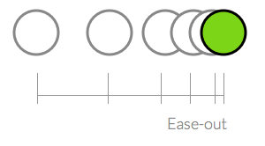
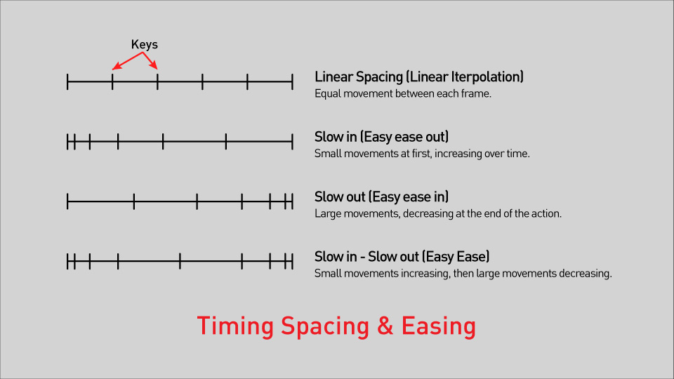
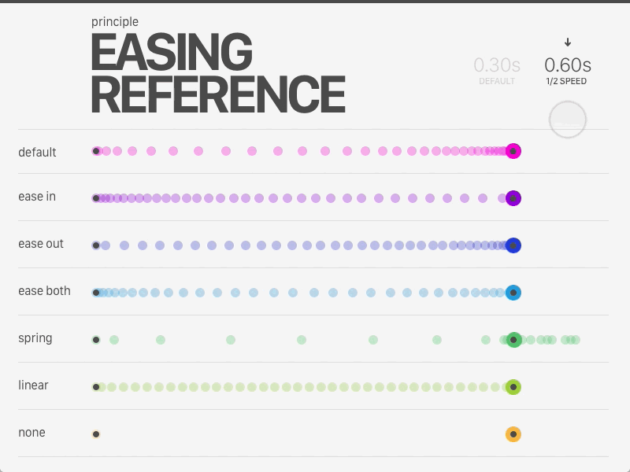

# CSS ANIMATION

## Transition Property and Animation Property Exercise

</br></br>

**Step 1**

- Create an HTML `div` with a class name of `parent`. Inside this div create another one with a class name of `child`. </br>
- In your css, specify an equal `height` and `width` to the parent div, and exactly the half of this value to the child div. </br>
- Also give a different background-color to each div. </br>

HTML

```
<div class="parent">
	<div class="child"></div>
</div>
```

CSS

```
.parent {
	background-color: #fafaff;
	width: 300px;
	height: 300px;
	margin: 10px;
}

.child {
	background-color: slateblue;
	width: 150px;
	height: 150px;
}
```

</br></br>

**Step 2**

- Move the child div from top left corner to the top right corner of the parent div, using transform translate. </br>
- **Tipp:** Be careful with `%`, it works in this case because the child is half size of the parent. </br>

CSS

```
.parent:hover .child {
	transform: translateX(100%);
}
```

</br></br>

**Step 3**

- Add a `transition` and specify the duration of animation for smoother effect. </br>
- Default value of transition will be `all` but we want to specify `transform`. </br>
  Transition contain: `transition-property`, `transition-delay`, `transition-duration`, `transition-timing-function`... </br>
- We could also specify the transition in `.parent:hover .child` instead of `.child`, or anywhere we want. </br>

CSS

```
.child {
	transition: transform 1s;
}
```

</br></br>

**Step 4**

- Choose a duration behavior, `ease`, `ease-out`, `ease-in-out`... </br>
- Default value is `linear`.</br>
- Select the child element in your browser developer tools and click on the curve icon to get the `cubic bezier` editor. </br>

https://cubic-bezier.com/

CSS

```
.child {
	transition: transform 1s ease-in-out;
}
```

</br></br>

**Step 5**

- Make it bounce out.</br>

CSS

```
.child {
	transition: transform 1s cubic-bezier(0.42, 0, 0.46, 1.7);
}
```

</br></br>

**Step 6**

- Let's now make it more interesting, we can do the same using a css `animation` instead of `transition`. </br>
- First comment out or delete those lines: </br>

CSS

```
.child {
	/* transition: transform 1s ease-in-out; */
}

parent:hover .child {
	/* transform: translateX(100%); */
}

```

</br></br>

**Step 7**

- On the hover, create a css `animation`, name it `left-to-right` or anything you want. Specify, `1s` and `ease-in-out` for duration and behavior. </br>
- Then declare your function `left-to-right`, using `@keyframe`. </br>
- The keyframe is declared on it's own in the CSS, same as you would declare a `@media` query. </br>
- In the keyframe we can now decide what happen at `100%`. </br>
- Default of `0%` is what we declared before. </br>

CSS

```
.parent:hover .child {
	animation: left-to-right 1s ease-in-out;
}

@keyframes left-to-right {
	100% {
		transform: translateX(100%);
	}
}
```

</br></br>

**Step 8**

- Specify `forwards` for the animation to stay in state, instead of jumping back to initial position. `forwards` come from `animation-fill-mode`. </br>

CSS

```
.parent:hover .child {
	animation: left-to-right 1s ease-in-out forwards;
}

```

</br></br>

**Step 9**

- Move it in a circle, adding `0%`, `33%`, `66%` and give them a position. </br>

CSS

```
@keyframes left-to-right {
	0% {
		transform: translateX(0);
	}
	33% {
		transform: translateY(100%);
	}
	66% {
		transform: translateX(100%) translateY(100%);
	}
	100% {
		transform: translateX(100%);
	}
}
```

</br></br>

**Step 10**

- Finally, add `infinite` or specify how many times.

CSS

```
.parent:hover .child {
	animation: left-to-right 1s ease-in-out forwards infinite;
}
```

</br></br>

**Challenge**

- Make the `child` come back to his starting point instead of top right corner of the `parent`.

</br></br>

**Bonus**

- Change background colors. </br>
- Try changing direction with `alternate`. </br>
- Move the animation to the `child` instead of `hover`. And pause it on hover. </br>
- **Advanced:** Chain up different animation using `animation-duration` and `animation-delay`.</br>

```
.child {
	animation: left-to-right 1s ease-in-out forwards infinite;
}

.parent:hover .child {
	animation-play-state: paused;
}
```

</br></br>

## Resources

</br>

**Original Video from Web Dev Simplified**

https://www.youtube.com/watch?v=YszONjKpgg4&ab_channel=WebDevSimplified

</br></br>

**Good Exercises**

https://cssbattle.dev/battle/1

https://codepen.io/jorgecardoso/post/1-css-transitions-and-animations

</br></br>

**The usuals**

https://css-tricks.com/almanac/properties/a/animation/

https://www.w3schools.com/css/css3_animations.asp

https://developer.mozilla.org/en-US/docs/Web/CSS/CSS_Animations/Using_CSS_animations

</br>

---

</br></br>

**Animation curve**


</br></br>

**Ease out**



**Ease in out**


</br></br>

**Easing**





</br></br>

**Summary**

https://docs.google.com/presentation/d/1wtlUZ0gW7a5SwJIcN_32Wqm3QLBE1_c7QJbEO8tJZLs/edit?usp=sharing

</br></br>
